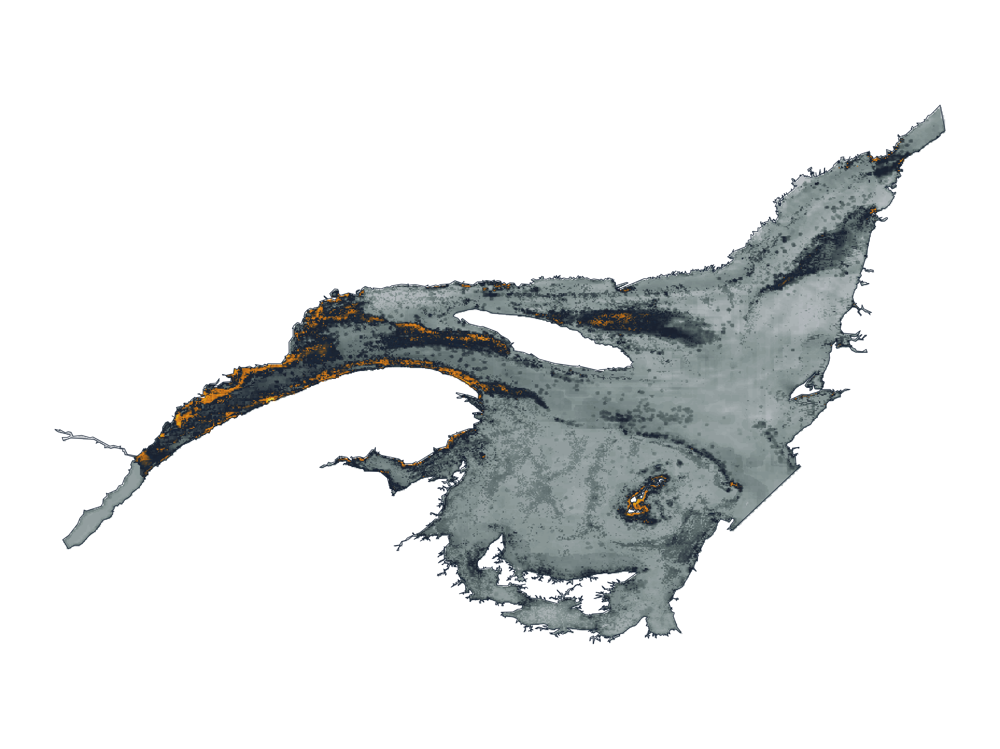
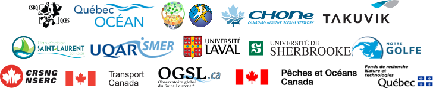

```{r setup, include=FALSE}
htmltools::tagList(rmarkdown::html_dependency_font_awesome())
```

class: title-slide, middle


# Cumulative effects assessment

## An ecosystem perspective


.pull-left[
<center></img></center>
]

.pull-right[
<center></img></center>
]


### David Beauchesne

<span class="br2"></span>

<center>
</img>
</center>

<span class="br2"></span>

#### [Version française](https://david-beauchesne.github.io/2021-09-24-AEIC/)

<span class="br2"></span>

#### 2021-09-24

<!-- =~-~=~-~=~-~=~-~=~-~=~-~=~-~=~-~=~-~=~-~=~-~=~-~=~-~=~-~=~-~=~-~=~-~= -->
<!-- =~-~=~-~=~-~=~-~=~-~=~-~=~-~=~-~=~-~=~-~=~-~=~-~=~-~=~-~=~-~=~-~=~-~= -->
<!-- =~-~=~-~=~-~=~-~=~-~=~-~=~-~=~-~=~-~=~-~=~-~=~-~=~-~=~-~=~-~=~-~=~-~= -->
<!-- Contexte -->
<!-- =~-~=~-~=~-~=~-~=~-~=~-~=~-~=~-~=~-~=~-~=~-~=~-~=~-~=~-~=~-~=~-~=~-~= -->
<!-- =~-~=~-~=~-~=~-~=~-~=~-~=~-~=~-~=~-~=~-~=~-~=~-~=~-~=~-~=~-~=~-~=~-~= -->
<!-- =~-~=~-~=~-~=~-~=~-~=~-~=~-~=~-~=~-~=~-~=~-~=~-~=~-~=~-~=~-~=~-~=~-~= -->
---

class: inverse, center, middle

# Context

<html><div style='float:left'></div><hr color='#ffdd55' style="margin-top:-30px" size=1px width=720px></html>


---

# Context

.pull-left[
- Ecologist

- Work focused on:
  - Human-species interactions
  - Conservation and management
  - Environmental effects
  - Environmental management
]


---

# Context

.pull-left[
- Ecologist

- Work focused on:
  - Human-species interactions
  - Conservation and management
  - Environmental effects
  - Environmental management
]

.pull-right[
- Few experiences with policies

- Experience not focused on environmental impacts assessment process
]


<!-- =~-~=~-~=~-~=~-~=~-~=~-~=~-~=~-~=~-~=~-~=~-~=~-~=~-~=~-~=~-~=~-~=~-~= -->
<!-- =~-~=~-~=~-~=~-~=~-~=~-~=~-~=~-~=~-~=~-~=~-~=~-~=~-~=~-~=~-~=~-~=~-~= -->
<!-- =~-~=~-~=~-~=~-~=~-~=~-~=~-~=~-~=~-~=~-~=~-~=~-~=~-~=~-~=~-~=~-~=~-~= -->
<!-- Évaluation des effets cumulatifs -->
<!-- =~-~=~-~=~-~=~-~=~-~=~-~=~-~=~-~=~-~=~-~=~-~=~-~=~-~=~-~=~-~=~-~=~-~= -->
<!-- =~-~=~-~=~-~=~-~=~-~=~-~=~-~=~-~=~-~=~-~=~-~=~-~=~-~=~-~=~-~=~-~=~-~= -->
<!-- =~-~=~-~=~-~=~-~=~-~=~-~=~-~=~-~=~-~=~-~=~-~=~-~=~-~=~-~=~-~=~-~=~-~= -->
---

class: inverse, center, middle

# Cumulative effects assessment

<html><div style='float:left'></div><hr color='#ffdd55' style="margin-top:-30px" size=1px width=720px></html>

<h2 style="color:#ffdd55;"><b>An ecosystem perspective</b></h2>
<h2>St. Lawrence System</h2>
<h2>Other projects</h2>
<h2>Knowledge management</h2>


---

# An ecosystem perspective

**Ecosystem management**: *management driven by explicit goals, executed by policies, protocols, and practices, and made adaptable by monitoring and research based on our best understanding of the ecological interactions and processes necessary to sustain ecosystem composition, structure, and function.*

--

**Cumulative effects**: *"effects that are likely to result from the project in combination with other projects or activities that have been or will be carried out."*

--

**Regional assessment**: *[A Regional Effects Assessment (REA)] is an [environmental assessment] whose primary or sole defining feature is its regional scope and its focus on understanding the interactions between human activities and the natural world.*


.references[
Loi canadienne sur l'évaluation environnementale (1992); Christensen et al. (1996); Sinclair et al. (2017)
]


---


# An ecosystem perspective

<center></img></center>

.references[
Halpern et al. 2008; Halpern et al. 2015
]


---

# An ecosystem perspective

<center></img></center>


.references[
Halpern et al. 2008; Halpern et al. 2015
]

---

# An ecosystem perspective

<br/><br/>

<center></img></center>

.references[
Halpern et al. 2008; Halpern et al. 2015
]

---

# An ecosystem perspective

<center></img></center>

.references[
Halpern et al. 2008; Halpern et al. 2015
]

---

# An ecosystem perspective


<center></img></center>

.references[
Halpern et al. 2008; Halpern et al. 2015
]


---

# An ecosystem perspective


<center></img></center>

.references[
Halpern et al. 2008; Halpern et al. 2015
]

---

# An ecosystem perspective

<center></img></center>

.references[
Halpern et al. 2008; Halpern et al. 2015
]

---
# An ecosystem perspective

<center></img></center>

???

- Considère toutefois que les stresseurs et les espèces sont indépendantes
- Plusieurs auteurs considèrent qu'il est irréaliste de considérer intégrer les interactions écologiques au sein d'évaluations environnementales dû à leur complexité
- Dans le cadre de ma thèse, je me suis efforcé à démontrer l'inverse en explorant l'importance de considérer les interactions et en développant une approche pour considérer explicitement les interactions et ainsi faire une évaluation des effets cumulatifs qui prend en considération les effets directs et indirects des stresseurs environnementaux.

---

# An ecosystem perspective

.pull-left2[
## Ecological interactions

**Indirects effects**

- Sea otters
- Sea urchins
- Kelp forests
]

.pull-right2[
<center></img></center>
]

.references[
Estes et Palmisano 1974; Paine 1980; Abrams 1992;  Estes et al. 2011
]

---

# An ecosystem perspective

.pull-left2[
## Ecological interactions

**Indirects effects**

- Sea otters
- Sea urchins
- Kelp forests

## Significance

- Can be as important as direct effects
]

.pull-right2[
<center></img></center>
]

.references[
Wootton 1993, 2002; Menge 1995; Yodzis 2000
]

---

# An ecosystem perspective

.pull-left2[
## Ecological interactions

**Indirects effects**

- Sea otters
- Sea urchins
- Kelp forests

## Significance

- Can be as important as direct effects

## Propagation of effects

- Network structure
  - Number of interactions
  - Configuration
  - Intensity
]

.pull-right2[
<center></img></center>
]

.references[
Wootton 2002; Bascompte 2009; Montoya et al. 2009; O’Gorman et Emmerson 2009; O’Gorman et al. 2012
]

---

# Une perspective écosystémique
# An ecosystem perspective

.pull-left2[
## Ecological interactions

**Indirects effects**

- Sea otters
- Sea urchins
- Kelp forests

## Significance

- Can be as important as direct effects

## Propagation of effects

- Network structure
  - Number of interactions
  - Configuration
  - Intensity
]

.pull-right2[
<center></img></center>
]

.references[
Wootton 2002; Bascompte 2009; Montoya et al. 2009; O’Gorman et Emmerson 2009; O’Gorman et al. 2012
]


<!-- =~-~=~-~=~-~=~-~=~-~=~-~=~-~=~-~=~-~=~-~=~-~=~-~=~-~=~-~=~-~=~-~=~-~= -->
<!-- =~-~=~-~=~-~=~-~=~-~=~-~=~-~=~-~=~-~=~-~=~-~=~-~=~-~=~-~=~-~=~-~=~-~= -->
<!-- =~-~=~-~=~-~=~-~=~-~=~-~=~-~=~-~=~-~=~-~=~-~=~-~=~-~=~-~=~-~=~-~=~-~= -->
<!-- Case study: EGSL -->
<!-- =~-~=~-~=~-~=~-~=~-~=~-~=~-~=~-~=~-~=~-~=~-~=~-~=~-~=~-~=~-~=~-~=~-~= -->
<!-- =~-~=~-~=~-~=~-~=~-~=~-~=~-~=~-~=~-~=~-~=~-~=~-~=~-~=~-~=~-~=~-~=~-~= -->
<!-- =~-~=~-~=~-~=~-~=~-~=~-~=~-~=~-~=~-~=~-~=~-~=~-~=~-~=~-~=~-~=~-~=~-~= -->
---

class: inverse, center, middle

# Cumulative effects assessment

<html><div style='float:left'></div><hr color='#ffdd55' style="margin-top:-30px" size=1px width=720px></html>

<h2> An ecosystem perspective</h2>
<h2 style="color:#ffdd55;"><b>St. Lawrence System</b></h2>
<h2>Other projects</h2>
<h2>Knowledge management</h2>

---

# St. Lawrence System

.pull-left2[
- St. Lawrence Estuary

- Gulf of Saint-Laurent
]

.pull-right2[
<center></img></center>
]


---

# St. Lawrence System

## Stressors


.pull-left[
- Climate (6)
- Land-based (5)
- Fisheries (5)
- Marine traffic (2)
]

.pull-right[
<center></img></center>
]

.references[
.font90[Halpern et al. 2015; DFO 2016; Statistics Canada 2017; Galbraith et al. 2018; Blais et al. 2019; Earth observation group 2019; Starr et Chassé 2019]
]

---

# St. Lawrence System

## Valued components

.pull-left2[
- Fish and invertebrates (169)
- Marine mammals (24)
- Interactions
]

.pull-right2[
<center></img></center>
]

.references[
.font90[Dutil et al. 2011, 2012; DFO 2016; Assis et al. 2018; Bourdages et al. 2018; Galbraith et al. 2018; Blais et al. 2019; Starr et Chassé 2019]
]

---

# St. Lawrence System

## Cumulative effects

<span class="br2"></span>

<center></img></center>


---

# St. Lawrence System

## Species or groups

<span class="br2"></span>

<center></img></center>

---

# St. Lawrence System

## Pathways of effects

.pull-left2[
- Links between stressors and species

- Risk associated with each stressor and for each species
]

.pull-right2[
<center></img></center>
]

---

# St. Lawrence System

## Direct effects

.pull-left2[

]

.pull-right2[
<center></img></center>
]

---

# St. Lawrence System

## Direct effects

.pull-left2[
Invertebrates: all stressors

- Sessile species
- Diet
- Body composition
- More sensitive to their physico-chemical environment

Vertebrates: shipping and fishing

- Mobile species
- Minimize exposure to stressors

]

.pull-right2[
<center></img></center>
]

.references[
Kroeker et al. 2010, 2013; Sydeman et al. 2015; Stier et al. 2016
]

---

# St. Lawrence System

## Indirect effects

.pull-left2[
Invertebrates: all stressors

- Lower relative intensity
- Resource / meso-predators

Vertebrates: all stressors

- Greater indirect effects intensity
- Higher trophic level species
- More sensitive to indirect effects
]

.pull-right2[
<center></img></center>
]

.references[
Kroeker et al. 2010, 2013; Sydeman et al. 2015; Stier et al. 2016
]


<!-- =~-~=~-~=~-~=~-~=~-~=~-~=~-~=~-~=~-~=~-~=~-~=~-~=~-~=~-~=~-~=~-~=~-~= -->
<!-- =~-~=~-~=~-~=~-~=~-~=~-~=~-~=~-~=~-~=~-~=~-~=~-~=~-~=~-~=~-~=~-~=~-~= -->
<!-- =~-~=~-~=~-~=~-~=~-~=~-~=~-~=~-~=~-~=~-~=~-~=~-~=~-~=~-~=~-~=~-~=~-~= -->
<!-- Gestion des connaissances -->
<!-- =~-~=~-~=~-~=~-~=~-~=~-~=~-~=~-~=~-~=~-~=~-~=~-~=~-~=~-~=~-~=~-~=~-~= -->
<!-- =~-~=~-~=~-~=~-~=~-~=~-~=~-~=~-~=~-~=~-~=~-~=~-~=~-~=~-~=~-~=~-~=~-~= -->
<!-- =~-~=~-~=~-~=~-~=~-~=~-~=~-~=~-~=~-~=~-~=~-~=~-~=~-~=~-~=~-~=~-~=~-~= -->
---

class: inverse, center, middle

# Cumulative effects assessment

<html><div style='float:left'></div><hr color='#ffdd55' style="margin-top:-30px" size=1px width=720px></html>

<h2> An ecosystem perspective</h2>
<h2>St. Lawrence System</h2>
<h2 style="color:#ffdd55;"><b>Other projects</b></h2>
<h2>Knowledge management</h2>


---

# Other projects

.pull-left2[
## Atlantic

- Scotian shelf
]

.pull-right2[
<center></img></center>
]


---

# Other projects

.pull-left2[
## Atlantic

- Scotian shelf


## Saguenay - Saint-Laurent

- Montréal to Pointe-des-Monts
- Maritime activities
]

.pull-right2[
<center></img></center>
]


---

# Other projects

.pull-left2[
## Saguenay - Saint-Laurent

Collaboration / mobilisation:

- Gouvernment of Canada
- Gouvernment of Québec
- First Nations
  - Abénakis
  - Huron-Wendat
  - Maliseet
  - Mohawk
  - Innu
- Local stakeholders
- Non-governmental organisations
]

.pull-right2[
<center></img></center>
]

---

# Other projects

## Saguenay - Saint-Laurent

<br/>


<center></img></center>

---

# Other projects

## Saguenay - Saint-Laurent

***Preliminary***

.pull-left[
<center></img></center>
]

--
.pull-right[
<center></img></center>
]

---

# Other projects

## Saguenay - Saint-Laurent

***Preliminary***

<center></img></center>


<!-- =~-~=~-~=~-~=~-~=~-~=~-~=~-~=~-~=~-~=~-~=~-~=~-~=~-~=~-~=~-~=~-~=~-~= -->
<!-- =~-~=~-~=~-~=~-~=~-~=~-~=~-~=~-~=~-~=~-~=~-~=~-~=~-~=~-~=~-~=~-~=~-~= -->
<!-- =~-~=~-~=~-~=~-~=~-~=~-~=~-~=~-~=~-~=~-~=~-~=~-~=~-~=~-~=~-~=~-~=~-~= -->
<!-- Gestion des connaissances -->
<!-- =~-~=~-~=~-~=~-~=~-~=~-~=~-~=~-~=~-~=~-~=~-~=~-~=~-~=~-~=~-~=~-~=~-~= -->
<!-- =~-~=~-~=~-~=~-~=~-~=~-~=~-~=~-~=~-~=~-~=~-~=~-~=~-~=~-~=~-~=~-~=~-~= -->
<!-- =~-~=~-~=~-~=~-~=~-~=~-~=~-~=~-~=~-~=~-~=~-~=~-~=~-~=~-~=~-~=~-~=~-~= -->
---

class: inverse, center, middle

# Cumulative effects

<html><div style='float:left'></div><hr color='#ffdd55' style="margin-top:-30px" size=1px width=720px></html>

<h2>An ecosystem perspective</h2>
<h2>St. Lawrence System</h2>
<h2>Other projects</h2>
<h2 style="color:#ffdd55;"><b>Knowledge management</b></h2>

---

# Knowledge management

## Management - Assessment - Knowledge

<span class="br2"></span>

.pull-right2[
<center></img></center>
]


---

# Knowledge management

## Management - Assessment - Knowledge

<span class="br2"></span>

.pull-left2[
- Dissociate knowledge acquisition
  - Efficiency
  - Common structure
  - Accessibility

- Collaboration, mobilisation et consultation processes are still vital

- Focus on management and assessment
]

.pull-right2[
<br/>
<center></img></center>
]

---

# Knowledge management

## Management - Assessment - Knowledge

<span class="br2"></span>

.pull-left2[
- Structure available knowledge

- Identify gaps in knowledge

- Human dimensions particularly lacking for cumulative effects assessments
]

.pull-right2[
<br/>
<center></img></center>
]


---

# Knowledge management

## Management - Assessment - Knowledge

<span class="br2"></span>

.pull-left2[
- From strictly environmental assessments to ...
]

.pull-right2[
<center></img></center>
]


---

# Knowledge management

## Management - Assessment - Knowledge

<span class="br2"></span>

.pull-left2[
- From strictly environmental assessments to ...

- assessments that explicitly consider social, cultural and economic issues
]

.pull-right2[
<center></img></center>
]


???

oO -> O

- Typiquement, l'acquisition de connaissances fait partie du processus d'évaluation

- Il faut reconnaître que l'évaluation des effets cumulatifs, comme d'autres approches holistiques, dépend d'expertises qui sont souvent acquises pour atteindre d'autres objectifs plus spécifiques. Ça veut dire que des données existent déjà, et que d'autres processus d'évaluation et de gestion environnementale ont besoin du même type de connaissances.


    O

O       O

- L'idée ici serait de dissocier le processus d'acquisition des connaissances du processus d'évaluation et de gestion est simplement de de dissocier le processus d'acquisition des connaissances pour le rendre plus efficace, mieux structuré et plus accessible.

- L'objectif n'est pas de dissocier les connaissances et les gens qui la détiennent du processus d'évaluation des effets cumulatifs et de la gestion. La necessité de collaboration, de mobilisation et de consultation d'une évaluation et de la gestion environnementale doit demeurer au centre des processus et des préoccupations.

- Dissocier et mieux structurer pour passer plus de temps à discuter d'évaluation des effets cumulatifs et de gestion environnementale, plutôt qu'à se questionner sur l'acquisition (ou le manque) de connaissances pour faire le travail

   oOo

O       O

- On va aussi pouvoir plus facilement identifier les lacunes en connaissances, et donc continuer d'améliorer nos bases de connaissances.

- Une lacune actuellement pour les évaluations d'effets cumulatifs demeure les dimensions humaines.


- Améliorer nos bases de connaissances à ce niveau pourra assurément nous permettre de grandement bonifier nos évaluations et nous permettre d'établir des liens clairs entre nos travaux déjà fait, et des dimensions humaines cruciales à la gestion de notre environnement.

    |
  --O--
    |


<!-- =~-~=~-~=~-~=~-~=~-~=~-~=~-~=~-~=~-~=~-~=~-~=~-~=~-~=~-~=~-~=~-~=~-~= -->
<!-- =~-~=~-~=~-~=~-~=~-~=~-~=~-~=~-~=~-~=~-~=~-~=~-~=~-~=~-~=~-~=~-~=~-~= -->
<!-- =~-~=~-~=~-~=~-~=~-~=~-~=~-~=~-~=~-~=~-~=~-~=~-~=~-~=~-~=~-~=~-~=~-~= -->
<!-- Thank you -->
<!-- =~-~=~-~=~-~=~-~=~-~=~-~=~-~=~-~=~-~=~-~=~-~=~-~=~-~=~-~=~-~=~-~=~-~= -->
<!-- =~-~=~-~=~-~=~-~=~-~=~-~=~-~=~-~=~-~=~-~=~-~=~-~=~-~=~-~=~-~=~-~=~-~= -->
<!-- =~-~=~-~=~-~=~-~=~-~=~-~=~-~=~-~=~-~=~-~=~-~=~-~=~-~=~-~=~-~=~-~=~-~= -->
---


class: inverse, center, middle

# Thank you!

<html><div style='float:left'></div><hr color='#ffdd55' style="margin-top:-30px" size=1px width=720px></html>

<br/>

<center></img></center>


<!-- rmarkdown::render('./index.Rmd') -->
